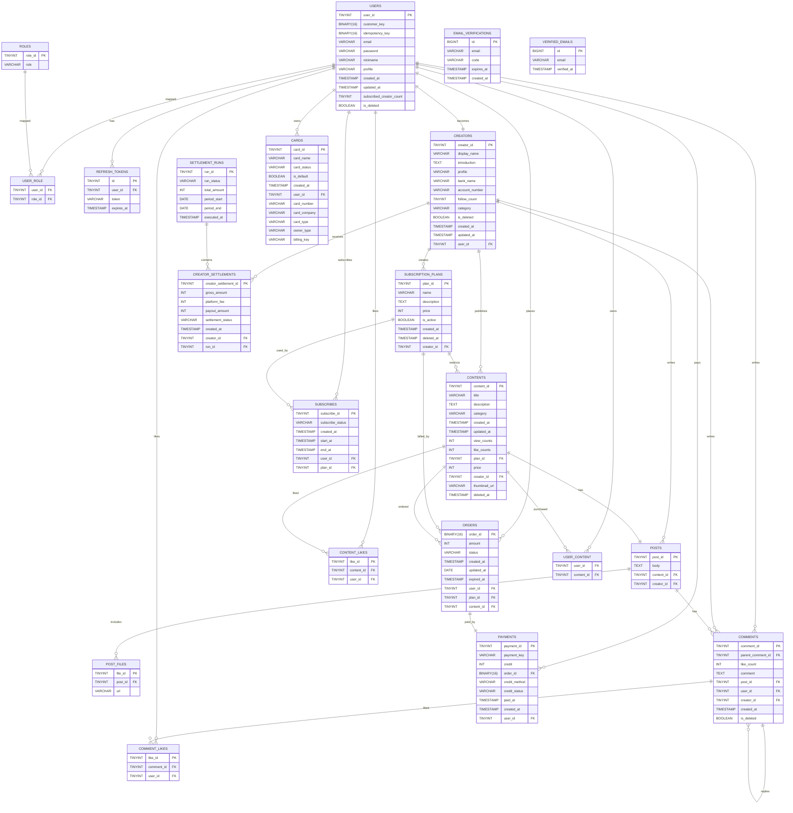
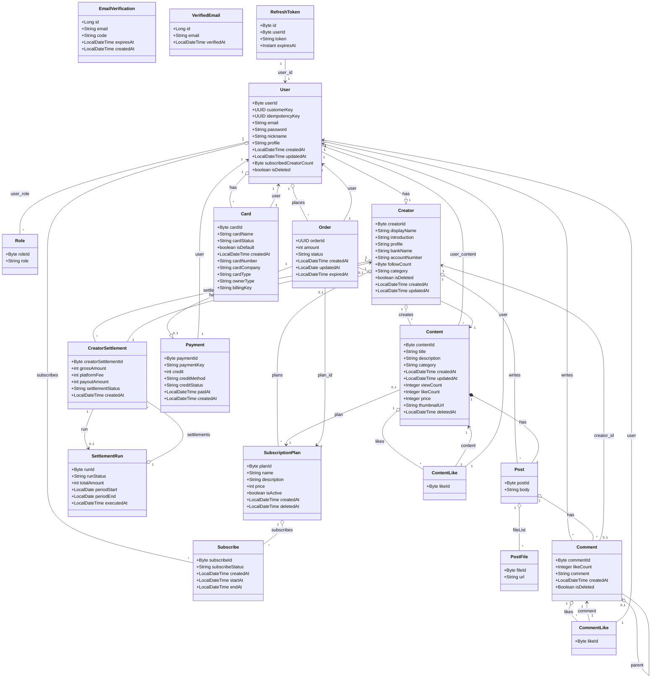

# 📝 Project: Skillary

> 지식을 콘텐츠로, 콘텐츠를 수익으로

---

## 📑 목차

1. [프로젝트 소개](#-프로젝트-소개)
2. [기술 스택](#-기술-스택)
3. [주요 기능](#-주요-기능)
4. [API 명세서](#-api-명세서)
5. [시스템 아키텍처](#-시스템-아키텍처)
6. [E-R Diagram](#-e-r-diagram)
7. [Class Diagram](#-class-diagram)
8. [시작하기 (Local Setup)](#-시작하기-local-setup)
9. [환경 변수 설정](#-환경-변수-설정)
10. [배포 방식](#-배포-방식)
11. [팀 정보](#-팀-정보)
12. [License](#️-license)

---

## 🚀 프로젝트 소개

* **개발 기간**: 2025.01.08 ~ 2025.01.21
* **핵심 가치**: 누구나 자신의 전뭉성과 콘텐츠를 수익화할 수 있는 플랫폼을 제공한다.

---
## 🛠 기술 스택

### Frontend

* **Framework**: Next.js 14+ (App Router)
* **Styling**: Tailwind CSS, Swiper
* **State Management**: SWR

### Backend

* **Language/Framework**: Java 21 / Spring Boot 3.x
* **Security**: Spring Security, JWT
* **Database**: MySQL 8.0
* **Storage**: AWS S3

### Infrastructure & DevOps

* **Server**: AWS EC2
* **Container**: Docker, Docker Compose
* **CI/CD**: GitHub Actions
* **Proxy**: Nginx

### Communication

* **Conference**: Notion
* **Live Coding**: Discord
* **Diagram Editor**: Miro
* **Presentation**: Canva

---

## ✨ 주요 기능

* **사용자 인증**: JWT 기반 인증 및 Refresh Token으로 세션 유지 및 보안 강화
* **결제 시스템**: 구독 및 유료 콘텐츠 결제 관련 Toss Payments 연동
* **다중 프로필**: 크리에이터, 유저 간의 전환
* **정산 시스템**: 매일 들어온 수익 및 매달 10일 정산이 완료
* **파일 업로드**: AWS S3를 이용한 프로필 및 콘텐츠 이미지, 영상 관리
* **게시판 기능**: 댓글 및 포스팅
* **기타**: 관리자 페이지, 검색 기능 등

---

## 📝 API 명세서

| 이름 | type | status | URL | body | 설명 |
| --- | --- | --- | --- | --- | --- |
| 회원가입 | POST | 201, 400 | /api/auth/register | { "email": string, "password": string, "nickname": string } | 이메일·비밀번호·닉네임으로 회원가입. 닉네임 4~12자, 한/영/숫자/밑줄만. |
| 닉네임 중복 확인 | GET | 200, 400 | /api/auth/check-nickname?nickname={nickname} | - | 닉네임 사용 가능 여부 조회. |
| 이메일 인증코드 발송 | POST | 201, 400, 500 | /api/auth/send-confirm | { "email": string } | 해당 이메일로 인증코드 전송. |
| 이메일 인증코드 확인 | POST | 201, 400, 500 | /api/auth/send-code | { "email": string, "code": string } | 6자리 코드로 이메일 인증. code 6자리 숫자. |
| 로그인 | POST | 201 | /api/auth/login | { "email": string, "password": string } | 로그인 후 AccessToken을 쿠키에 설정. |
| 토큰 갱신 | POST | 201, 401 | /api/auth/refresh | - | 쿠키의 AccessToken으로 새 AccessToken 발급. |
| 로그아웃 | POST | 204 | /api/auth/logout | - | 로그아웃 시 쿠키의 AccessToken 제거. |
| 내 정보 조회 | GET | 200 | /api/users/me | - | 로그인 사용자 정보 조회. (인증 필요) |
| 내 정보 수정 | PUT | 204, 400 | /api/users/me | { "nickname": string, "profile": string } | 닉네임·프로필 수정. 닉네임 4~12자. |
| 유저 삭제(소프트) | DELETE | 204, 404 | /api/users/{userId} | - | 해당 유저 소프트 삭제 (isDeleted=true). |
| 크리에이터 등록 | POST | 201, 400 | /api/creators | { "introduction": string, "category": string, "profile": string, "bankName": string, "accountNumber": string } | 로그인 유저를 크리에이터로 전환. (인증) |
| 크리에이터 목록 | GET | 200 | /api/creators | - | 크리에이터 전체 목록 조회. |
| 크리에이터 상세 | GET | 200, 404 | /api/creators/{creatorId} | - | 크리에이터 상세 조회. |
| 내 크리에이터 조회 | GET | 200 | /api/creators/me | - | 로그인 유저의 크리에이터 정보. (인증) |
| 크리에이터 수정 | PUT | 204 | /api/creators/me | { "nickname": string, "profile": string, "category": string, "introduction": string, "bankName": string, "accountNumber": string } | 내 크리에이터·유저 프로필 수정. (인증) |
| 크리에이터 삭제(소프트) | DELETE | 204, 404 | /api/creators/{creatorId} | - | 크리에이터 소프트 삭제. |
| 추천 크리에이터 | GET | 200 | /api/creators/recommended | - | 구독자 수 순 추천 크리에이터 목록. |
| 콘텐츠 생성 | POST | 201, 403 | /api/contents | { "title": string, "description": string, "category": string, "planId": number, "price": number, "thumbnailUrl": string, "post": { "body": string, "postFiles": string[] } } | 콘텐츠·포스트 생성. 크리에이터만. (인증) |
| 콘텐츠 수정 | PUT | 200, 403 | /api/contents/{contentId} | { "title": string, "description": string, "category": string, "planId": number, "price": number, "thumbnailUrl": string, "post": { "body": string, "postFiles": string[] } } | 콘텐츠·포스트 수정. 본인만. (인증) |
| 카테고리 목록 | GET | 200 | /api/contents/categories | - | 콘텐츠 카테고리(enum) 목록. |
| 콘텐츠 목록 | GET | 200 | /api/contents?page=0&size=10 | - | 콘텐츠 슬라이스(page, size). |
| 인기 콘텐츠 | GET | 200 | /api/contents/popular?page=0&size=10 | - | 좋아요 순 인기 콘텐츠. |
| 크리에이터별 콘텐츠 | GET | 200 | /api/contents/creators/{creatorId}?page=0&size=10 | - | 특정 크리에이터의 콘텐츠 목록. |
| 카테고리별 콘텐츠 | GET | 200 | /api/contents/category/{category}?page=0&size=10&sort=latest | - | 카테고리별 콘텐츠. sort: latest 등. |
| 콘텐츠 상세 | GET | 200 | /api/contents/{contentId} | - | 상세·포스트·댓글 포함, 조회수 증가. (인증 선택) |
| 삭제 미리보기 | GET | 200, 403 | /api/contents/{contentId}/delete-preview | - | 삭제 시 영향 미리보기. 크리에이터만. (인증) |
| 콘텐츠 삭제 | DELETE | 204, 403 | /api/contents/{contentId} | - | 콘텐츠·연관 파일 삭제. 크리에이터만. (인증) |
| 콘텐츠 좋아요 | POST | 200 | /api/contents/{contentId}/like | - | 콘텐츠 좋아요 토글. (인증) |
| 댓글 목록 | GET | 200 | /api/contents/{contentId}/comments | - | 해당 콘텐츠 댓글 목록. |
| 댓글 작성 | POST | 201, 401 | /api/contents/{contentId}/comments | { "comment": string, "parentId": number } | 댓글/대댓글 작성. parentId 있으면 대댓글. (인증) |
| 댓글 수정 | PUT | 200, 401 | /api/contents/{contentId}/comments/{commentId} | { "comment": string, "parentId": number } | 댓글 수정. (인증) |
| 댓글 삭제 | DELETE | 204, 401 | /api/contents/{contentId}/comments/{commentId} | - | 댓글 삭제. (인증) |
| 댓글 좋아요 | POST | 204, 401 | /api/contents/{contentId}/comments/{commentId}/like | - | 댓글 좋아요 토글. (인증) |
| 고객 키 발급 | POST | 200 | /api/payments/customer-key | - | 결제용 고객 키 조회. (인증) |
| 카드 등록 | POST | 204 | /api/payments/cards | { "customerKey": string, "authKey": string } | 토스 결제 연동 카드 등록. (인증) |
| 카드 목록 | GET | 200 | /api/payments/cards?page=0&size=10 | - | 내 카드 목록 페이징. (인증) |
| 주문 목록 | GET | 200 | /api/payments/orders?page=0&size=10 | - | 내 주문 목록 페이징. (인증) |
| 유료 콘텐츠 주문 | POST | 201 | /api/payments/orders/payment | { "contentId": number } | 유료 콘텐츠 1회성 결제용 주문 생성. (인증) |
| 구독 결제 주문 | POST | 201 | /api/payments/orders/billing | { "planId": number } | 구독 플랜 빌링키 결제용 주문 생성. (인증) |
| 단건 결제 완료 | POST | 201 | /api/payments/complete/payment | { "orderId": string, "paymentKey": string, "amount": number } | 유료 콘텐츠 결제 완료(토스 등 연동). (인증) |
| 구독 결제 완료 | POST | 201 | /api/payments/complete/billing | { "orderId": string, "planName": string, "customerKey": string, "subscriptionFee": number } | 구독 결제 완료(빌링키). (인증) |
| 결제 내역 | GET | 200 | /api/payments?page=0&size=10 | - | 내 결제 내역 페이징. (인증) |
| 주문 단건 조회 | GET | 200 | /api/payments/{orderId} | - | 주문 상세. 콘텐츠/플랜에 따라 응답 타입 다름. (인증) |
| 카드 삭제 | DELETE | 204 | /api/payments/card/{cardId} | - | 등록 카드 삭제. (인증) |
| 구독 플랜 생성 | POST | 201 | /api/subscriptions | { "planName": string, "description": string, "price": number } | 크리에이터 구독 플랜 생성. (인증) |
| 구독 플랜 조회 | GET | 200 | /api/subscriptions/{planId} | - | 플랜 상세. |
| 구독 플랜 목록 | GET | 200 | /api/subscriptions/plans?page=0&size=10 | - | 구독 플랜 페이징. (인증) |
| 구독 목록 | GET | 200 | /api/subscriptions?page=0&size=10 | - | 내 구독 목록 페이징. (인증) |
| 구독 플랜 삭제 | DELETE | 204 | /api/subscriptions/plans/{planId} | - | 내 플랜 비활성화(삭제). (인증) |
| 구독 해지 | DELETE | 204 | /api/subscriptions/{planId} | - | 해당 플랜 구독 해지. (인증) |
| 정산 목록 | GET | 200 | /api/settlements?page=0&size=10 | - | 크리에이터 정산 목록 페이징. (인증) |
| 정산 상세 | GET | 200 | /api/settlements/{settlementId} | - | 정산 1건 상세. (인증) |
| 정산 런(관리자) | GET | 200 | /api/settlements/admin?page=0&size=10 | - | 정산 런(회차) 목록. Admin용. (인증) |
| 이미지 업로드 | POST | 200, 400, 500 | /api/files/image | multipart/form-data: file | 이미지 S3 업로드, URL 반환. |
| 영상 업로드 | POST | 200, 400, 500 | /api/files/video | multipart/form-data: file |  |

---

## 🏗 시스템 아키텍처

본 프로젝트는 **Nginx를 리버스 프록시(Reverse Proxy)** 및 **API 게이트웨이**로 활용하여 보안성과 효율성을 높인 아키텍처를 가집니다. 모든 컨테이너는 **Docker Compose**를 통해 단일 네트워크 내에서 격리되어 관리됩니다.

#### 1. 외부 요청 흐름 (Traffic Flow)

* **포트 단일화**: 사용자는 오직 **80 포트(HTTP)**를 통해 서비스에 접속합니다. 외부로 노출되는 포트를 최소화하여 보안을 강화했습니다.
* **경로 기반 라우팅(Path-based Routing)**:
* `/api`로 시작하는 모든 요청: Nginx가 내부망의 **Backend(Spring Boot, 8080포트)**로 전달합니다.
* 그 외의 모든 요청 (`/`): **Frontend(Next.js, 3000포트)**로 전달하여 사용자에게 UI를 제공합니다.


#### 2. 컨테이너 아키텍처

* **Frontend**: Next.js의 `standalone` 빌드 방식을 채택하여 이미지 크기를 최적화했으며, 클라이언트 측 환경변수를 빌드 시점에 주입하여 보안 사고를 방지했습니다.
* **Backend**: Spring Boot 기반 애플리케이션으로, 서비스 레이어에서 데이터 정합성을 관리하며 AWS S3, MySQL, 이메일 서버와 통신합니다.
* **Database**: MySQL 컨테이너는 외부 노출 없이 오직 Backend 컨테이너와 동일한 Docker 내부 네트워크 상에서만 통신하도록 설정되어 데이터 접근 권한을 엄격히 제한했습니다.


#### 3. 배포 파이프라인 (CI/CD)

* GitHub에 코드가 푸시되면 GitHub Actions가 가동됩니다.
* 프론트엔드는 빌드 시점에 API 주소를 주입받아 Docker 이미지를 생성한 후 Docker Hub에 푸시합니다.
* EC2 서버는 최신 이미지를 pull 받아 무중단에 가까운 배포(Rolling Update 방식의 수동 재시작)를 수행합니다.

---

## 🧑🏼‍💻 E-R Diagram

<details>
  <summary><strong>ERD Mermaid 펼처보기쳐</strong></summary>



</details>


## 🐞 Class Diagram


<details>
  <summary><strong>Class Diagram 펼쳐보기</strong></summary>




</details>

## 💻 시작하기 (Local Setup)

```bash
# 레포지토리 클론
git clone https://github.com/your-repo/skillary.git

# Docker Compose를 이용한 실행
cd next-skillary-front && docker compose -f docker-compose.dev.yml up --build -d
cd spring-skillary-back && docker compose -f docker-compose.dev.yml up --build -d
```

## 🔐 환경 변수 설정

이 프로젝트는 빌드 시점에 환경변수 주입이 필요합니다.

#### Spring

```bash
### spring-skillary-back/.env.dev
# Spring 데이터베이스 설정
SPRING_DATASOURCE_URL=
SPRING_DATASOURCE_USERNAME=
SPRING_DATASOURCE_PASSWORD=
SPRING_DATASOURCE_DRIVER_CLASS_NAME=

CORS_ALLOWED_ORIGINS=http://localhost:3000

SPRING_JPA_HIBERNATE_DDL_AUTO=create
SPRING_JPA_SHOW_SQL=true
SPRING_JPA_PROPERTIES_HIBERNATE_FORMAT_SQL=true
SPRING_JPA_PROPERTIES_HIBERNATE_DIALECT=org.hibernate.dialect.MySQLDialect

SPRING_PROFILES_ACTIVE=dev

# Toss Payments 설정
TOSS_PAYMENTS_SECRET_KEY=
TOSS_PAYMENTS_CLIENT_KEY=

# 이메일 설정
SPRING_MAIL_HOST=
SPRING_MAIL_PORT=
SPRING_MAIL_USERNAME=
SPRING_MAIL_PASSWORD=

# 이메일 템플릿 설정
APP_MAIL_FROM=
APP_MAIL_SUBJECT=
APP_MAIL_CODE_EXPIRY_MINUTES=300

# Jwt Token 설정
JWT_SECRET_KEY=
JWT_EXPIRE_TIME_ACCESS=
JWT_EXPIRE_TIME_REFRESH=

# AWS S3 설정
AWS_ACCESS_KEY_ID=
AWS_SECRET_ACCESS_KEY=
AWS_S3_BUCKET_NAME=
AWS_S3_REGION=
```

#### Database

```bash
### spring-skillary-back/.env.db
MYSQL_USER=
MYSQL_PASSWORD=
MYSQL_DATABASE=
MYSQL_ROOT_PASSWORD=

# 필요시 추가
MYSQL_QUERY_CACHE_SIZE=
MYSQL_THREAD_CACHE_SIZE=
MYSQL_INNODB_BUFFER_POOL_SIZE=
MYSQL_MAX_CONNECTIONS=
```

#### Next

```bash
## next-skillary-front/.env.dev
NEXT_PUBLIC_FRONT_API_URL=http://localhost:8080/api
```

## 🚢 배포 방식

* **CI/CD**: GitHub
* **Dockerizing**: Multi-stage build를 통해 최적화된 이미지 생성 (`standalone` 빌드 방식 채택)

## 👥 팀 정보 - 1단 돌아감

* **1팀** : 전주현, 남혜린
* **1팀 담당** : 회원, 프로필, 정산

* **2팀** : 박성훈, 김영진, 정병천
* **2팀 담당** :  결제 관련, 컨텐츠, 댓글, 구독

---

## ⚖️ License

Copyright 2024. **Skillary Team** all rights reserved.

본 프로젝트의 모든 코드, 디자인, 문서에 대한 저작권은 **Skillary 팀**에 있으며, 다음과 같은 사항을 엄격히 금지합니다:
- **무단 도용 및 복제**: 본 프로젝트의 소스 코드나 결과물을 무단으로 복사하여 사용하는 행위
- **2차 수정 및 변형**: 본 프로젝트를 바탕으로 수정한 후 재배포하거나 본인의 저작물로 게시하는 행위
- **상업적 이용**: 본 프로젝트의 결과물을 영리 목적으로 사용하는 행위

허가되지 않은 복제, 배포 및 2차 가공은 저작권법에 의해 법적 처벌을 받을 수 있습니다.